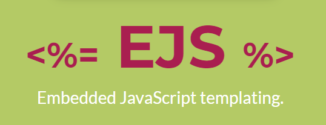

# Template Engine - EJS

<div style="text-align: center">



</div>

Projeto desenvolvido para estudos durante o curso do [Programador Br](https://programadorbr.com), neste projeto aprendi como trabalhar com template engine e [NodeJs](https://nodejs.dev/). O EJS é uma engine de visualização, com ele conseguimos de uma maneira fácil e simples transportar dados do back-end para o front-end, basicamente conseguimos utilizar códigos em javascript no html de nossas páginas

## 🛠 Instalando

```bash
# Clone este repositorio
$ git clone <https://github.com/matdevz/NODE-EJS.git>

# Instale as dependencias
$ npm install || yarn add

# Iniciar no ambiente de desenvolvimento
$ npm run dev || yarn run dev

# Iniciar no ambiente de produção
$ npm start || yarn start

# O servir vai rodar na porta 3001
$ http://localhost:3001

```
